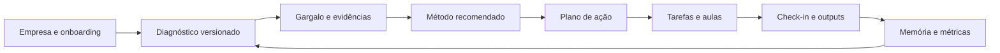

# Arquitetura inicial do Fábrica Ágil

## 1. Decisão executiva

### Fatos

- O produto precisa guardar dados da empresa, diagnóstico, gargalo, método recomendado, plano, tarefas, aulas, conversas, memória, evidências e métricas.
- O método de diagnóstico ainda será fornecido.
- O MVP não deve começar como ERP, MES, PCP completo, BI avançado ou plataforma de integrações.

### Inferências

- Prender perguntas e regras em código tornaria cada ajuste de método uma mudança de software.
- Guardar tudo em JSON reduziria a rastreabilidade de empresa, sessão, tarefa e resultado.
- Um chat sem diagnóstico e base de métodos produziria recomendações genéricas.

### Recomendação

Usar um núcleo relacional estável e uma camada configurável e versionada para diagnóstico e métodos.

## 2. Opções e trade-offs

### Opção A — lógica inteira no prompt

- Curto prazo: implementação rápida.
- Longo prazo: baixa auditabilidade, respostas inconsistentes e dificuldade para saber qual regra gerou a conclusão.
- Custo de oportunidade: economiza modelagem agora, mas atrasa produto confiável e casos de sucesso defensáveis.

### Opção B — regras inteiras em código

- Curto prazo: comportamento previsível.
- Longo prazo: cada ajuste do método exige desenvolvimento, teste e deploy.
- Custo de oportunidade: reduz flexibilidade durante a fase em que mais se aprende com clientes.

### Opção C — contratos versionados no banco

- Curto prazo: exige modelo de dados mais disciplinado.
- Longo prazo: permite atualizar perguntas, pontuação e métodos sem perder o histórico de como cada diagnóstico foi produzido.
- Recomendação: Opção C.

## 3. Fluxo central

## 4. Limites dos módulos

### Empresa

Guarda cadastro, tipo de produção, tamanho da equipe, onboarding e usuários vinculados. O isolamento por empresa existe no modelo, embora o MVP não tenha alternância multiempresa.

### Diagnóstico

`DiagnosticTemplate` e `DiagnosticQuestion` versionam o método. `DiagnosticSession` e `DiagnosticAnswer` registram exatamente o que foi respondido e qual versão foi aplicada.

### Gargalo

`BottleneckAssessment` registra hipótese, evidências, impacto, urgência e confiança separadamente. Um gargalo pode ser monitorado, resolvido ou descartado.

### Métodos

`ImprovementMethod` identifica o método. `MethodVersion` guarda regras de aplicabilidade, contraindicações, passos, inputs e critérios de sucesso. `MethodRecommendation` liga diagnóstico, gargalo e versão do método.

### Execução

`ActionPlan`, `Task` e `TaskDependency` formam o mapa de execução. Tarefas aceitam responsável, prioridade, prazo, subtarefas, bloqueios e output esperado.

### Educação

`Lesson` guarda o conteúdo. `MethodLesson` liga a aula à versão do método. `LessonAssignment` registra quem deve assistir, progresso e relação com o plano.

### Acompanhamento

`ProgressCheckin`, `EvidenceOutput`, `MetricDefinition` e `MetricMeasurement` respondem se a ação foi aplicada e qual resultado apareceu.

### Contexto e memória

`ConversationThread` e `ConversationMessage` guardam conversas. `CompanyMemory` guarda memória estruturada com tipo, origem, confiança, validade e invalidação.

### Agente de IA

O Agents SDK roda somente no servidor. `loadCompanyContext` monta um snapshot
limitado da empresa ativa; o agente recebe esse snapshot e devolve uma saída
validada por schema com fatos, inferências, opções, trade-offs, recomendação,
abstenção e evidências ausentes. Não existe rota pública de chat antes de
autenticação e autorização por empresa.

## 5. Alertas

### Risco alto — recomendação sem evidência

O sistema deve conseguir abster-se. Se dados mínimos ou confiança não forem atingidos, a saída correta é pedir nova evidência, não escolher um método.

### Risco alto — vazamento entre empresas

Antes do beta, toda leitura e escrita precisa usar o contexto autenticado da empresa. O modelo de dados ajuda, mas não substitui autorização.

### Premissa ainda fraca — disposição de uso

Não há evidência neste projeto de que gestores preencherão um diagnóstico longo. O fluxo deve entregar valor com poucas perguntas e aprofundar progressivamente.

### Inconsistência a evitar — curso genérico

Aula precisa estar vinculada ao método e terminar em tarefa prática. Conteúdo consumido sem aplicação não prova melhoria.

## 6. Fora do setup atual

- autenticação e autorização;
- assinatura e cobrança;
- embeddings ou RAG;
- upload real de evidências;
- notificações;
- ERP, MES, PCP, estoque ou financeiro;
- integrações externas;
- políticas finais de privacidade e retenção.

## 7. Próxima sequência recomendada

1. Formalizar o método de diagnóstico.
2. Cadastrar um template e os métodos mínimos para um problema.
3. Implementar onboarding e execução do diagnóstico.
4. Implementar regra de gargalo com abstenção.
5. Gerar plano e tarefas a partir de uma recomendação aceita.
6. Adicionar autenticação e autorização antes de dados reais.
7. Conectar IA somente com contexto e ferramentas limitadas.
